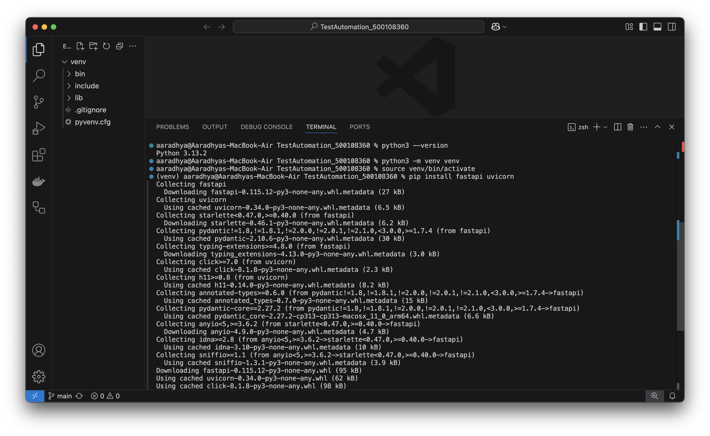
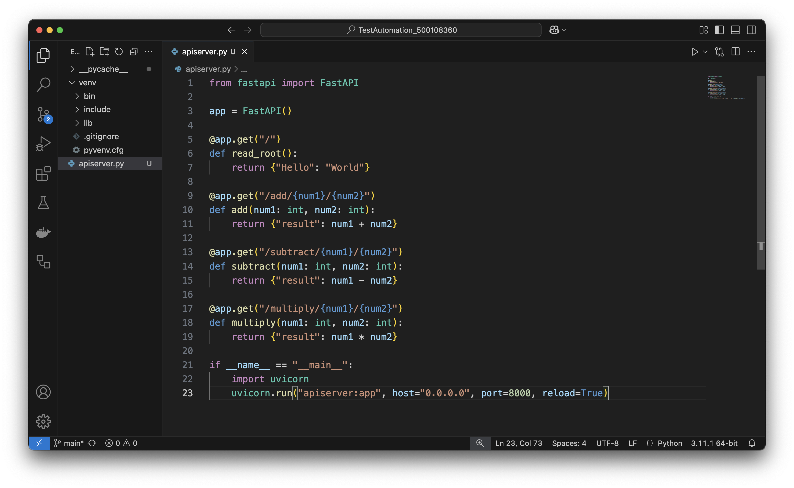
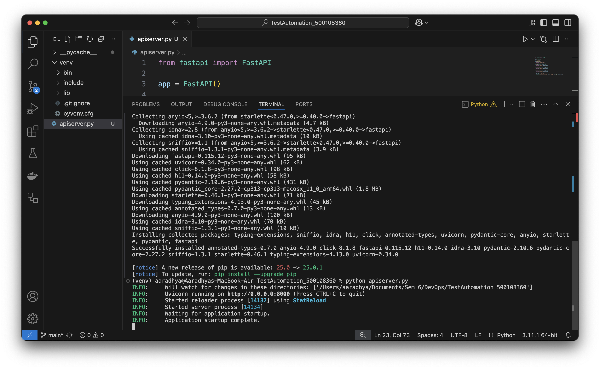
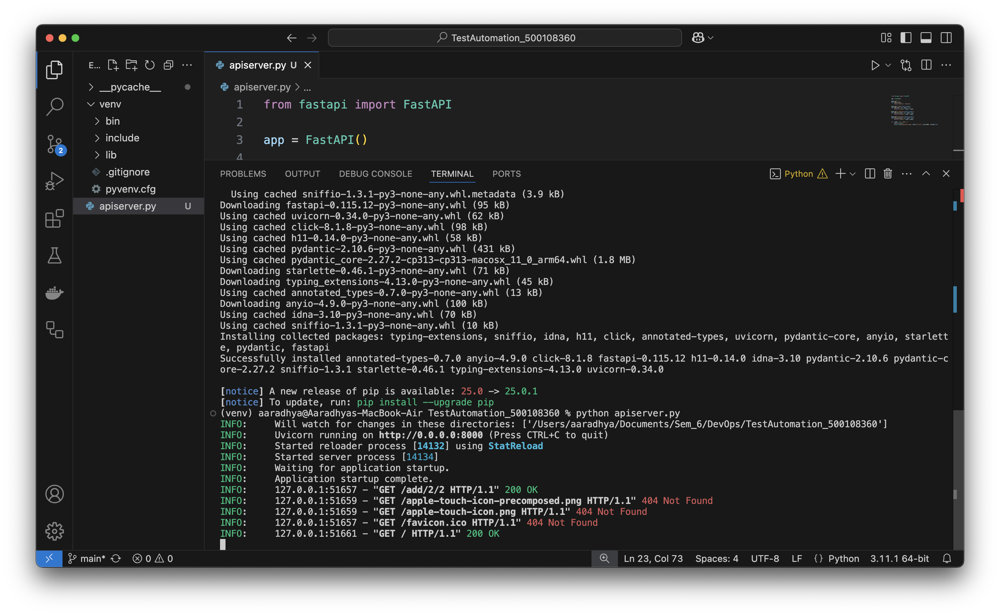

Here's a comprehensive `README.md` file for your project, incorporating all the details from your assignment and the files in your directory:

```markdown
# DevOps Test Automation Project

 

## Project Overview
This project demonstrates a FastAPI backend with automated testing and GitHub Actions CI/CD integration, created as part of the DevOps curriculum.

**Student Details:**
- Name: Aaradhya Agrawal
- SapId: 500108360
- Roll No.: R2142221002
- Program: B.Tech[CSE]
- Batch: CCVT-B2
- Submitted to: Mr. Prateek Raj Gautam

## Project Structure
```
TestAutomation_500108360/
├── __pycache__/
├── apiserver.py             # FastAPI server implementation
├── testAutomation.py        # Basic API tests
├── testAutomationPytest.py  # Enhanced pytest implementation
├── venv/                    # Python virtual environment
├── .github/workflows/       # GitHub Actions configuration
└── images/                  # Screenshots (image_1.png to image_15.png)
```

## Setup Instructions

### 1. Prerequisites
- Python 3.8+
- pip
- Git

### 2. Installation
```bash
# Clone the repository
git clone https://github.com/yourusername/TestAutomation_500108360.git
cd TestAutomation_500108360

# Create and activate virtual environment
python -m venv venv
source venv/bin/activate  # On Windows: venv\Scripts\activate

# Install dependencies
pip install fastapi uvicorn requests pytest
```

### 3. Running the API Server
```bash
python apiserver.py
```
The server will be available at `http://localhost:8000`

### 4. API Endpoints
- `GET /add/{num1}/{num2}` - Addition
- `GET /subtract/{num1}/{num2}` - Subtraction
- `GET /multiply/{num1}/{num2}` - Multiplication



## Testing

### 1. Basic Tests
```bash
python testAutomation.py
```

### 2. Pytest Implementation
```bash
pytest testAutomationPytest.py
```


## GitHub Actions CI/CD
The project includes automated testing via GitHub Actions. On every push:
1. Sets up Python environment
2. Installs dependencies
3. Runs the FastAPI server
4. Executes pytest tests



## Screenshots
- Image 6: Server startup
- Image 7: Basic test execution
- Image 8: Pytest results
- Image 9: GitHub Actions workflow
- Images 10-15: Additional implementation details

## Future Enhancements (Task 5)
1. **Database Integration**: Add PostgreSQL/MongoDB support
2. **Authentication**: Implement JWT/OAuth2
3. **Logging**: Add centralized logging
4. **Performance Testing**: Include load testing with Locust

## Troubleshooting
If you encounter port conflicts (as noted in the assignment):
```bash
# Change the port in apiserver.py
uvicorn.run("apiserver:app", host="0.0.0.0", port=8001)  # Use any available port
```

## License
This project is for educational purposes as part of the UTAWGitA curriculum.
```

**Notes:**
1. Replace `yourusername` with your actual GitHub username
2. The image references (image_1.png to image_15.png) should match your actual screenshot files
3. You may want to organize the images in an `images/` subfolder
4. For GitHub, you can drag-and-drop the images into the README when editing it directly on GitHub

Would you like me to modify any specific section or add more details about any particular part of the project?
