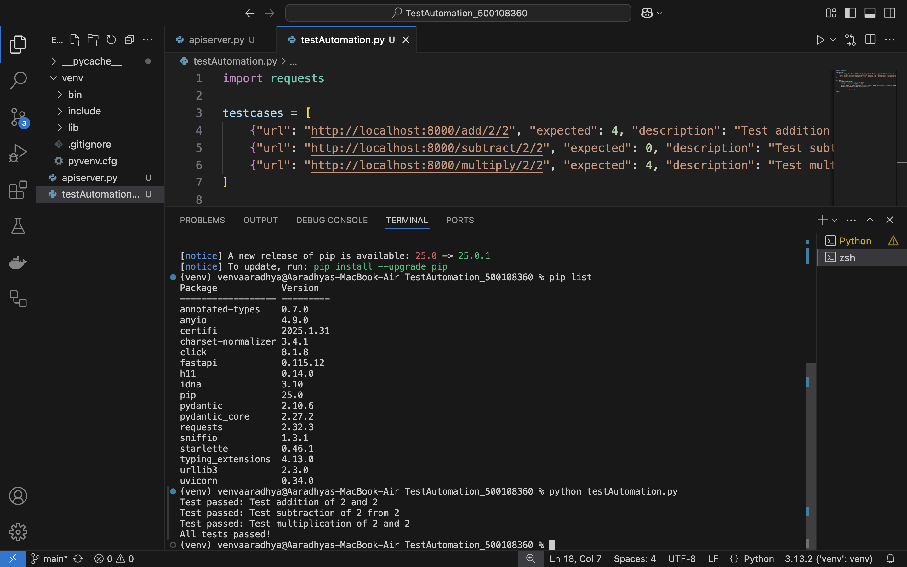

# FastAPI Test Automation with GitHub Actions 🚀

## 📌 Overview
This project demonstrates how to set up a **FastAPI backend**, automate API testing with **pytest**, and integrate it into a **GitHub Actions CI/CD pipeline**. The goal is to ensure APIs are tested continuously and remain functional in real-world DevOps workflows.

---

## 📁 Project Structure
```
FastAPI-Test-Automation/
│── apiserver.py            # FastAPI server with basic math operations  
│── testAutomationPytest.py # Pytest script for API tests  
│── .github/workflows/test.yml  # GitHub Actions workflow   
│── README.md               # This documentation  
│── images                 # Screenshots of implementation  
```

---

## 🛠️ Task 1: Set Up the FastAPI Server
### 1️⃣ Install Required Packages
Run the following command to install dependencies:
```bash
pip install fastapi uvicorn
```


### 2️⃣ Create the FastAPI Server (`apiserver.py`)
```python
from fastapi import FastAPI

app = FastAPI()

@app.get("/")
def read_root():
    return {"Hello": "World"}

@app.get("/add/{num1}/{num2}")
def add(num1: int, num2: int):
    return {"result": num1 + num2}

@app.get("/subtract/{num1}/{num2}")
def subtract(num1: int, num2: int):
    return {"result": num1 - num2}

@app.get("/multiply/{num1}/{num2}")
def multiply(num1: int, num2: int):
    return {"result": num1 * num2}

if __name__ == "__main__":
    import uvicorn
    uvicorn.run("apiserver:app", host="0.0.0.0", port=8000, reload=True)
```


### 3️⃣ Run the Server
```bash
python apiserver.py
```


Server will be available at **http://localhost:8000**  


#### 📌 API Endpoints:
- **Addition:** `GET /add/2/2`
- **Subtraction:** `GET /subtract/5/3`
- **Multiplication:** `GET /multiply/2/3`


---

## 🧪 Task 2: Writing Automated Tests
### 1️⃣ Install Requests Library
```bash
pip install requests
```


### 2️⃣ Create the Test Script (`testAutomation.py`)
```python
import requests

testcases = [
    {"url": "http://localhost:8000/add/2/2", "expected": 4, "description": "Test addition of 2 and 2"},
    {"url": "http://localhost:8000/subtract/2/2", "expected": 0, "description": "Test subtraction of 2 from 2"},
    {"url": "http://localhost:8000/multiply/2/2", "expected": 4, "description": "Test multiplication of 2 and 2"}
]

def test():
    for case in testcases:
        response = requests.get(case["url"])
        result = response.json()["result"]
        assert result == case["expected"], f"Test failed: {case['description']}. Expected {case['expected']}, got {result}"
        print(f"Test passed: {case['description']}")

test()
```


### 3️⃣ Run the Tests
```bash
python testAutomation.py
```


---

## 🔍 Task 3: Enhancing Tests with Pytest
### 1️⃣ Install Pytest
```bash
pip install pytest
```


### 2️⃣ Create the Pytest Script (`testAutomationPytest.py`)
```python
import pytest
import requests

testcases = [
    ("http://localhost:8000/add/2/2", 4, "Test addition of 2 and 2"),
    ("http://localhost:8000/subtract/2/2", 0, "Test subtraction of 2 from 2"),
    ("http://localhost:8000/multiply/2/2", 4, "Test multiplication of 2 and 2"),
    ("http://localhost:8000/add/-1/1", 0, "Test addition of -1 and 1"),
    ("http://localhost:8000/multiply/0/5", 0, "Test multiplication by zero"),
]

@pytest.mark.parametrize("url, expected, description", testcases)
def test_api(url, expected, description):
    response = requests.get(url)
    result = response.json()["result"]
    assert result == expected, f"{description}. Expected {expected}, got {result}"
```


### 3️⃣ Run the Tests with Pytest
```bash
pytest testAutomationPytest.py
```


## 🔄 Task 4: Integrating Test Automation with GitHub Actions
### 1️⃣ Create a GitHub Actions Workflow
```yaml
name: API Tests

on:
  push:
    branches:
      - main
  pull_request:
    branches:
      - main

jobs:
  test:
    runs-on: ubuntu-latest

    steps:
      - name: Checkout code
        uses: actions/checkout@v2

      - name: Set up Python
        uses: actions/setup-python@v2
        with:
          python-version: "3.10"

      - name: Install dependencies
        run: |
          python -m pip install --upgrade pip
          pip install fastapi uvicorn pytest requests

      - name: Start FastAPI server
        run: |
          nohup python apiserver.py &
        env:
          PYTHONUNBUFFERED: 1

      - name: Wait for server to be ready
        run: sleep 5  # Wait to ensure the server is up

      - name: Run tests
        run: pytest testAutomationPytest.py
```


### 2️⃣ Commit and Push to GitHub
```bash
git add .
git commit -m "Add test automation and GitHub Actions"
git push origin main
```


### 3️⃣ View GitHub Actions Results


##  Task 5: Expanding the Automation for Real-World Projects
**1. Add Database Integration**
Instead of simple arithmetic, imagine an API that fetches/stores data in a PostgreSQL or MongoDB database. 
Testing would involve:
- Checking data integrity after each API call.
- Mocking database connections for isolated testing.
  
**2. Authentication and Authorization**
- Add OAuth2, JWT, or API keys for secure endpoints.
- Test unauthorized access to ensure security.

**3. Advanced Error Handling & Logging:**
- Add logging to track API usage and errors.
- Store logs in centralized systems like CloudWatch or ELK Stack.

**4. Performance Testing:**
- Use tools like **pytest-benchmark** or **locust.io** for load testing.

---
🚀 Developed by Aaradhya Agrawal
---

### 📌 Submission To-
- **Professor:** Mr. Prateek Raj Gautam
